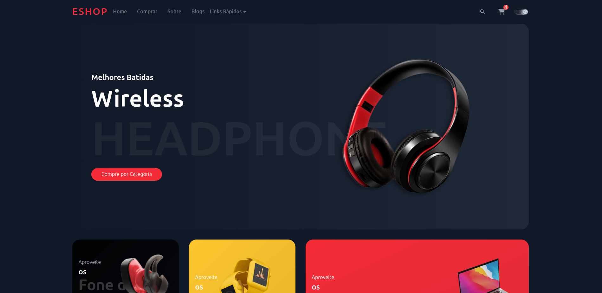
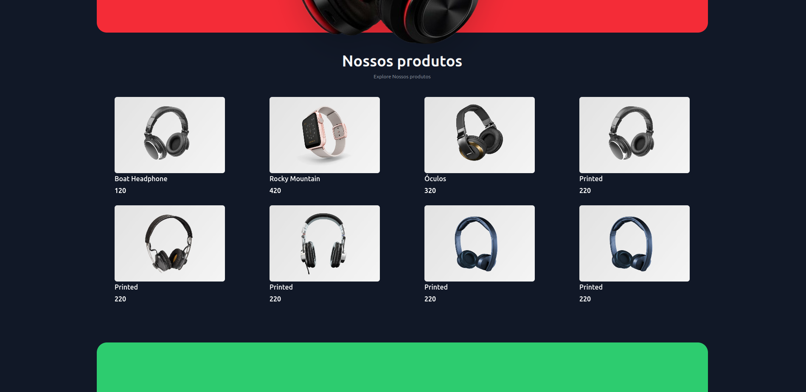
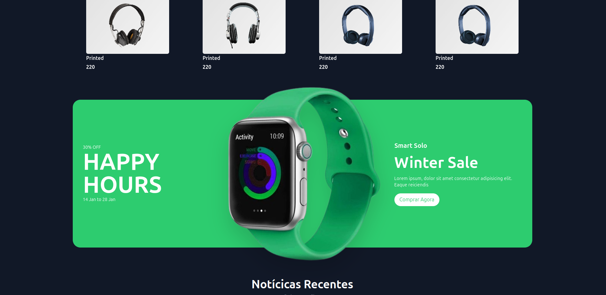
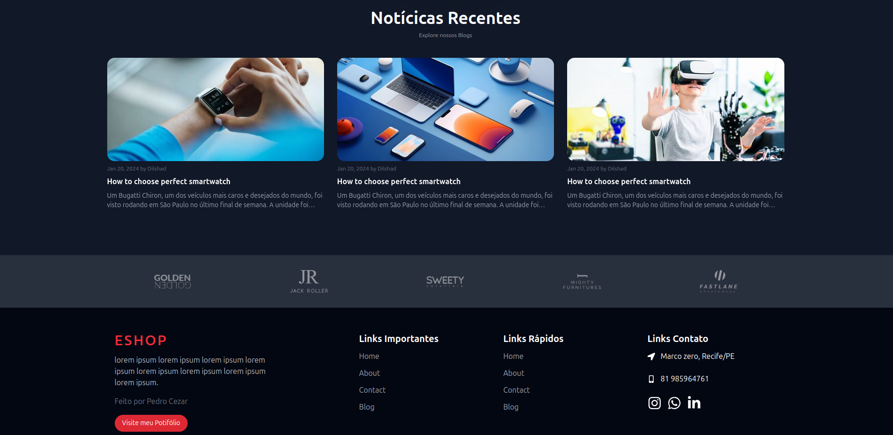

# Template de Layout para Ecommerce 

<h1> Template para Ecommerce </h1>

```js
A página foi desenvolvida com intuito de treinar o conhecimneto 
com estilização com Tailwind css e como examplo de template de Ecommerce.

 * A página possui:
   - animações nos elementos em toda página;
   - Design Moderno interativo e intuitivo;
   - Template Responsivo para todos tamanhos de Relas;
```

# Link 
Acesse o Link do meu Projeto:

Link do meu site 💻: https://layout-ecommerce-rosy.vercel.app/

# Screenshot
Veja a captura de tela do projeto:






